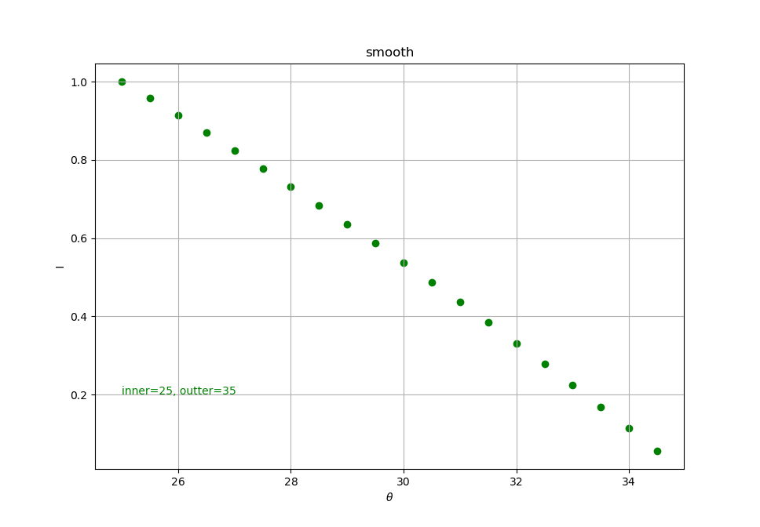
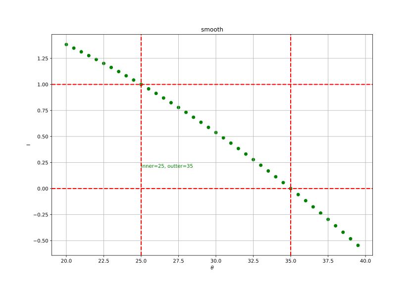

# 平滑 /  软化边缘

为了创建一种看起来边缘平滑的聚光，我们需要模拟聚光有一个内圆锥(Inner Cone)和一个外圆锥(Outer Cone)。我们可以将内圆锥设置为上一部分中的那个圆锥，但我们也需要一个外圆锥，来让光从内圆锥逐渐减暗，直到外圆锥的边界。

为了创建一个外圆锥，我们只需要再定义一个余弦值来代表聚光方向向量和外圆锥向量（等于它的半径）的夹角。然后，如果一个片段处于内外圆锥之间，将会给它计算出一个0.0到1.0之间的强度值。如果片段在内圆锥之内，它的强度就是1.0，如果在外圆锥之外强度值就是0.0。

我们可以用下面这个公式来计算这个值：
$$
\begin{equation} I = \frac{\theta - \gamma}{\epsilon} \end{equation}
$$
这里 $\epsilon$ (Epsilon)是内（$\phi$）和外圆锥（$\gamma$）之间的余弦值差（$\epsilon = \phi - \gamma$）。最终的 $I$ 值就是在当前片段聚光的强度。

很难去表现这个公式是怎么工作的，所以我们用一些实例值来看看：

| $\theta$ | $\theta$ (角度) | $\phi$ (内光切) | $\phi$ | $\gamma$ (外光切) | $\gamma$ | $\epsilon$         | I                             |
| -------- | --------------- | --------------- | ------ | ----------------- | -------- | ------------------ | ----------------------------- |
| 0.87     | 30              | 0.91            | 25     | 0.82              | 35       | 0.91 - 0.82 = 0.09 | $\frac{0.87-0.82}{0.09}=0.56$ |
| 0.9      | 26              | 0.91            | 25     | 0.82              | 35       | 0.91 - 0.82 = 0.09 | (0.9 - 0.82)/0.09 = 0.89      |

第一个参数函数图如下：



```glsl
	// 聚光的 smooth 效果
    float theta = dot(lightDir, normalize(-light.direction));
    float epsilon = (light.cutOff - light.outerCutOff);
    // 注意，在 innerCutOff 内的光线不进行衰减，在 innerCutOff 到 outerCutOff 之间的光线进行衰减，在大于
    // outerCutOff 的部分没有光照。
    float intensity = clamp( (theta - light.outerCutOff) / epsilon, 0.0, 1.0);
    diffuse     *= intensity;
    specular    *= intensity;
```

可以参考下面的图：



## 效果


