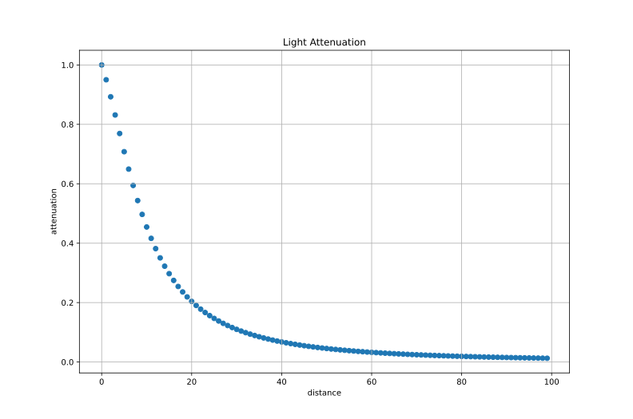
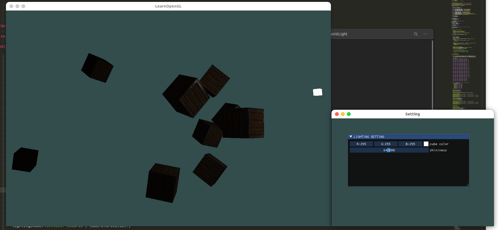

# 点光源

定向光对于照亮整个场景的全局光源是非常棒的，但除了定向光之外我们也需要一些分散在场景中的点光源(Point Light)。点光源是处于世界中某一个位置的光源，它会朝着所有方向发光，但光线会随着距离逐渐衰减。想象作为投光物的灯泡和火把，它们都是点光源。

在之前的教程中，我们一直都在使用一个（简化的）点光源。我们在给定位置有一个光源，它会从它的光源位置开始朝着所有方向散射光线。然而，我们定义的光源模拟的是永远不会衰减的光线，这看起来像是光源亮度非常的强。在大部分的3D模拟中，我们都希望模拟的光源仅照亮光源附近的区域而不是整个场景。

## 衰减

随着光线传播距离的增长逐渐削减光的强度通常叫做衰减(Attenuation)。随距离减少光强度的一种方式是使用一个线性方程。这样的方程能够随着距离的增长线性地减少光的强度，从而让远处的物体更暗。然而，这样的线性方程通常会看起来比较假。在现实世界中，灯在近处通常会非常亮，但随着距离的增加光源的亮度一开始会下降非常快，但在远处时剩余的光强度就会下降的非常缓慢了。所以，我们需要一个不同的公式来减少光的强度。

幸运的是一些聪明的人已经帮我们解决了这个问题。下面这个公式根据片段距光源的距离计算了衰减值，之后我们会将它乘以光的强度向量：
$$
\begin{equation} F_{att} = \frac{1.0}{K_c + K_l * d + K_q * d^2} \end{equation}
$$
在这里 $d$ 代表了片段距光源的距离。接下来为了计算衰减值，我们定义3个（可配置的）项：常数项 $K_{c}$、一次项 $K_{l}$ 和二次项$K_{q}$。

- 常数项通常保持为1.0，它的主要作用是保证分母永远不会比1小，否则的话在某些距离上它反而会增加强度，这肯定不是我们想要的效果。
- 一次项会与距离值相乘，以线性的方式减少强度。
- 二次项会与距离的平方相乘，让光源以二次递减的方式减少强度。二次项在距离比较小的时候影响会比一次项小很多，但当距离值比较大的时候它就会比一次项更大了。

由于二次项的存在，光线会在大部分时候以线性的方式衰退，直到距离变得足够大，让二次项超过一次项，光的强度会以更快的速度下降。这样的结果就是，光在近距离时亮度很高，但随着距离变远亮度迅速降低，最后会以更慢的速度减少亮度。

下面的图中为 distance = 100 时候的函数曲线：

## 例子

