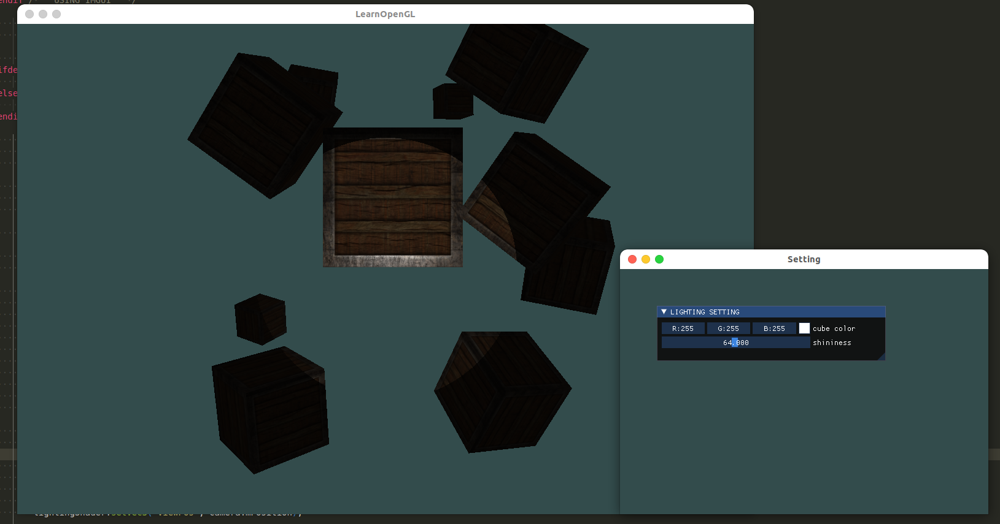

# 聚光

我们要讨论的最后一种类型的光是聚光(Spotlight)。聚光是位于环境中某个位置的光源，它只朝一个特定方向而不是所有方向照射光线。这样的结果就是只有在聚光方向的特定半径内的物体才会被照亮，其它的物体都会保持黑暗。聚光很好的例子就是路灯或手电筒。

```OpenGL```中聚光是用一个世界空间位置、一个方向和一个切光角(Cutoff Angle)来表示的，切光角指定了聚光的半径（译注：是圆锥的半径不是距光源距离那个半径）。对于每个片段，我们会计算片段是否位于聚光的切光方向之间（也就是在锥形内），如果是的话，我们就会相应地照亮片段。下面这张图会让你明白聚光是如何工作的：


* LightDir: 从片段指向光源的向量
* SpotDir: 聚光所指向的方向
* Phi: $\phi$ 指定了聚光半径的切光角。落在这个角度之外的物体都不会被这个聚光所照亮。
* Theta: $\theta$ ```LightDir```向量和```SpotDir```向量之间的夹角。在聚光内部的话 $\theta$ 值应该比 $\phi$ 值小。

所以我们要做的就是计算```LightDir```向量和``SpotDir``向量之间的点积（还记得它会返回两个单位向量夹角的余弦值吗？），并将它与切光角$\phi$值对比。你现在应该了解聚光究竟是什么了，下面我们将以手电筒的形式创建一个聚光。

## 手电筒

手电筒(Flashlight)是一个位于观察者位置的聚光，通常它都会瞄准玩家视角的正前方。基本上说，手电筒就是普通的聚光，但它的位置和方向会随着玩家的位置和朝向不断更新。

所以，在片段着色器中我们需要的值有聚光的位置向量（来计算光的方向向量）、聚光的方向向量和一个切光角。我们可以将它们储存在Light结构体中：

```glsl
struct Light {
    vec3 position;  // 光源的位置
    vec3 direction; // 光源照射的中心方向
    float cutOff;   // 指定了聚光半径的切光角  落在这个角度之外的物体都不会被这个聚光所照亮 注意这里存储的是 cos 余弦值
    float outerCutOff;

    vec3 ambient;   // 指定环境光照的强度，以及环境光照的颜色
    vec3 diffuse;   // 指定漫反射光照的强度，以及漫反射光照的颜色
    vec3 specular;  // 指定镜面光照的强度，一般这个强度值设置为 glm::vec3(1.0f, 1.0f, 1.0f)

    float constant;     // 常数项
    float linear;       // 一次线性项
    float quadratic;    // 二次项
};
```

接下来我们将合适的值传递给着色器：

```cpp
// 设置手电筒相关
lightingShader.setVec3("light.position", camera.mPosition);
lightingShader.setVec3("light.direction", camera.mFront);
lightingShader.setFloat("light.cutOff", glm::cos(glm::radians(12.5f))); // 这里送入的是 \cos(\Phi) 而不直接送入角度
lightingShader.setVec3("viewPos", camera.mPosition);
```

你可以看到，我们并没有给切光角设置一个角度值，反而是用角度值计算了一个余弦值，将余弦结果传递到片段着色器中。这样做的原因是在片段着色器中，我们会计算`LightDir`和`SpotDir`向量的点积，这个点积返回的将是一个余弦值而不是角度值，所以我们不能直接使用角度值和余弦值进行比较。为了获取角度值我们需要计算点积结果的反余弦，这是一个开销很大的计算。所以为了节约一点性能开销，我们将会计算切光角对应的余弦值，并将它的结果传入片段着色器中。由于这两个角度现在都由余弦角来表示了，我们可以直接对它们进行比较而不用进行任何开销高昂的计算。

接下来就是计算 $\theta$ 值，并将其和切光角 $\phi$ 进行比较，来决定被照射的物体是否在聚光的内部：

```glsl
vec3 lightDir = normalize(light.position - FragPos);

// 检查光线是否在光源的角度之内
float theta = dot(lightDir, normalize(-light.direction));

if (theta > light.cutOff)   
// 需要注意的是上面的 dot() 函数计算出来的是 theta 角度的 cos 值，所以这里我们使用 > 表示在切光角范围内的物体
{
```

我们首先计算了```lightDir```和取反的```direction```向量（取反的是因为我们想让向量指向光源而不是从光源出发）之间的点积。记住要对所有的相关向量标准化。

## 结果



但这仍看起来有些假，主要是因为聚光有一圈硬边。当一个片段遇到聚光圆锥的边缘时，它会完全变暗，没有一点平滑的过渡。一个真实的聚光将会在边缘处逐渐减少亮度。

